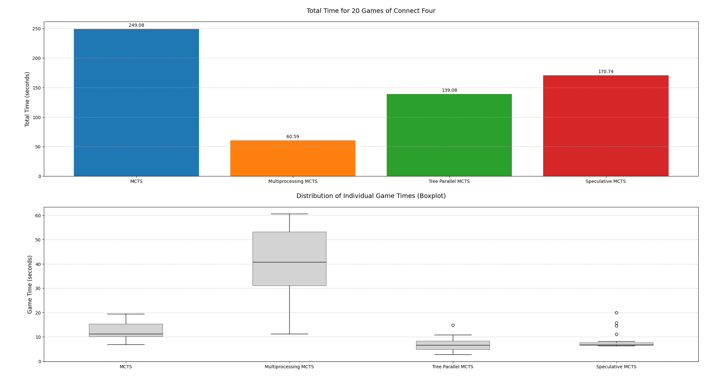
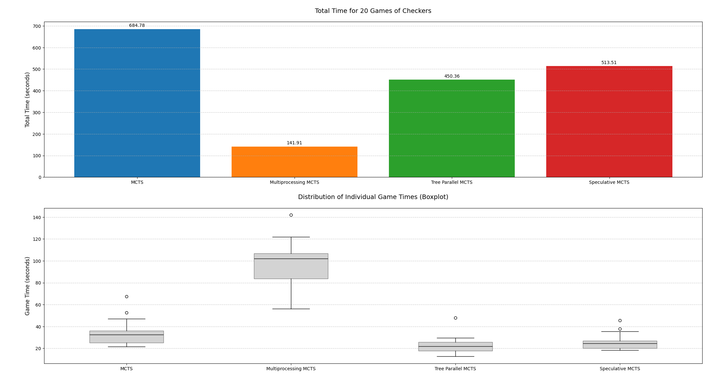

# Parallel MCTS Comparison

This project explores the performance of different parallelization techniques applied to Monte Carlo Tree Search (MCTS) algorithms. We used **OpenSpiel** to simulate gameplay environments (Connect Four and Checkers) and implemented all MCTS logic and parallelization in **Python**.

## Overview

- **Objective**: Evaluate the effectiveness of different parallel MCTS strategies.
- **Games**: Connect Four and Checkers (via OpenSpiel).
- **Techniques**: Compared implementations using multithreading, multiprocessing, and other parallel patterns.
- **Evaluation**: We measured how long it takes to complete 20 full games for each parallelization method.
- **Motivation**: These methods could help speed up self-play in AlphaZero-style reinforcement learning algorithms.

## Results

### Connect Four


### Checkers


## Dependencies

- Python 3.8+
- [OpenSpiel](https://github.com/deepmind/open_spiel)
- `matplotlib`
- `numpy`
- `ray`

Install the dependencies:

```bash
pip install open_spiel matplotlib numpy
